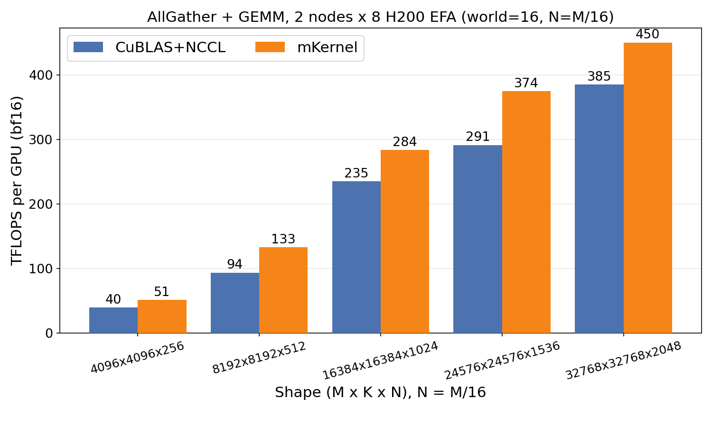
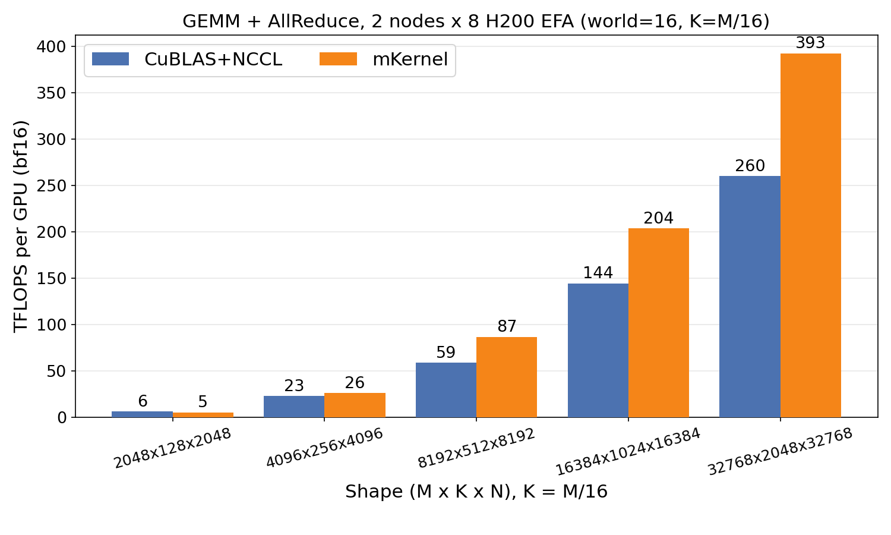
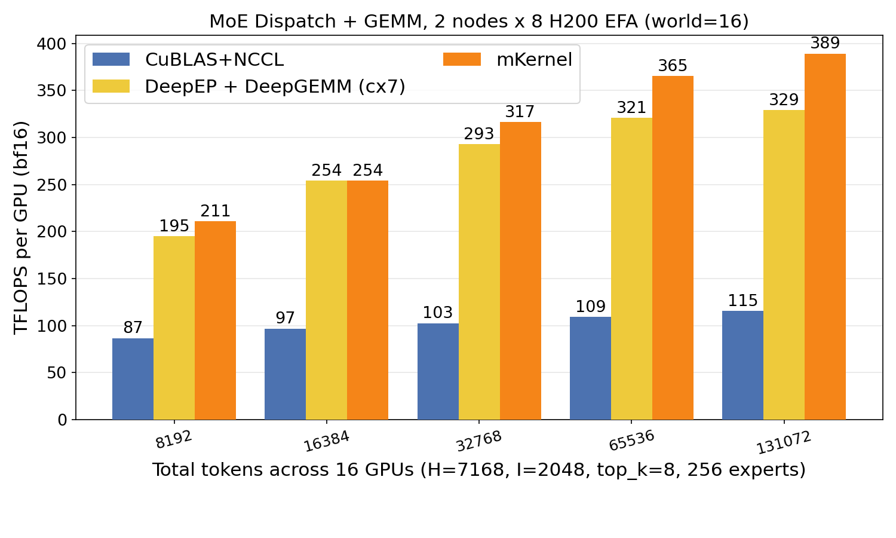
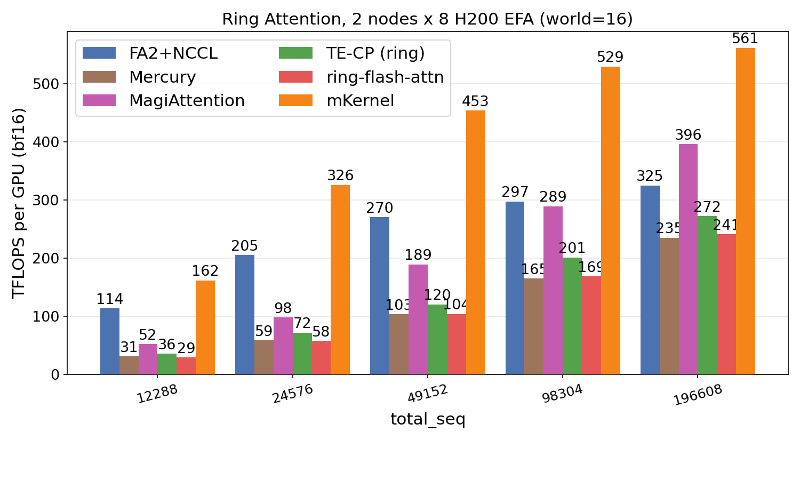
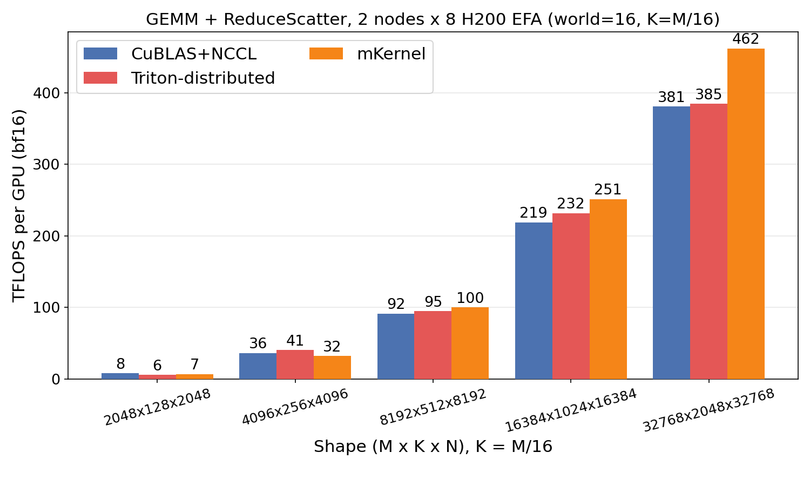
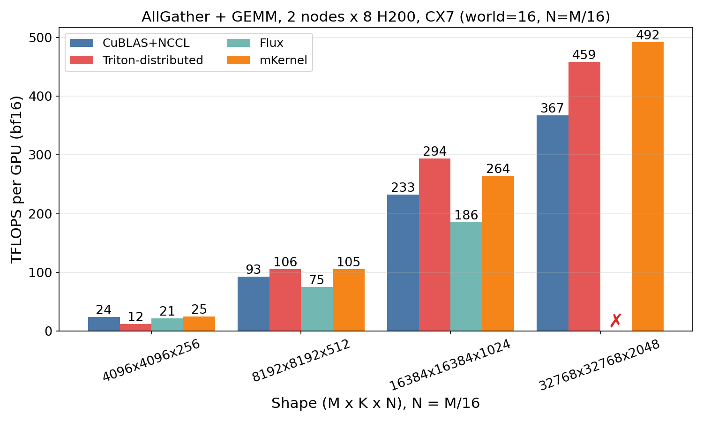
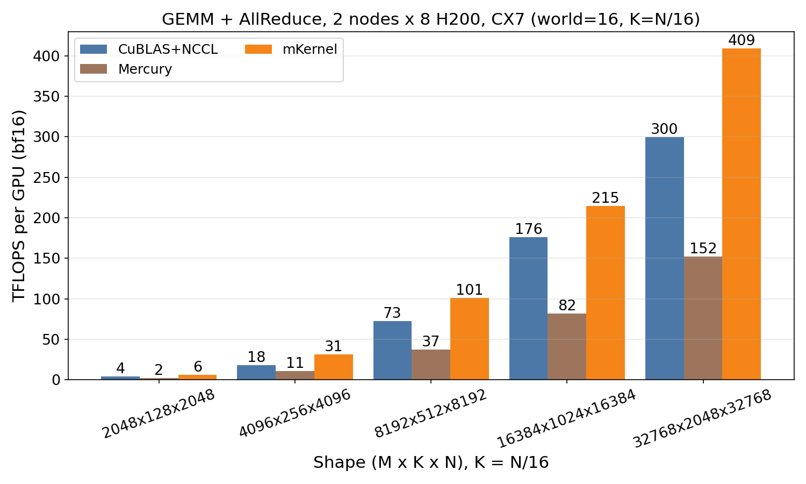
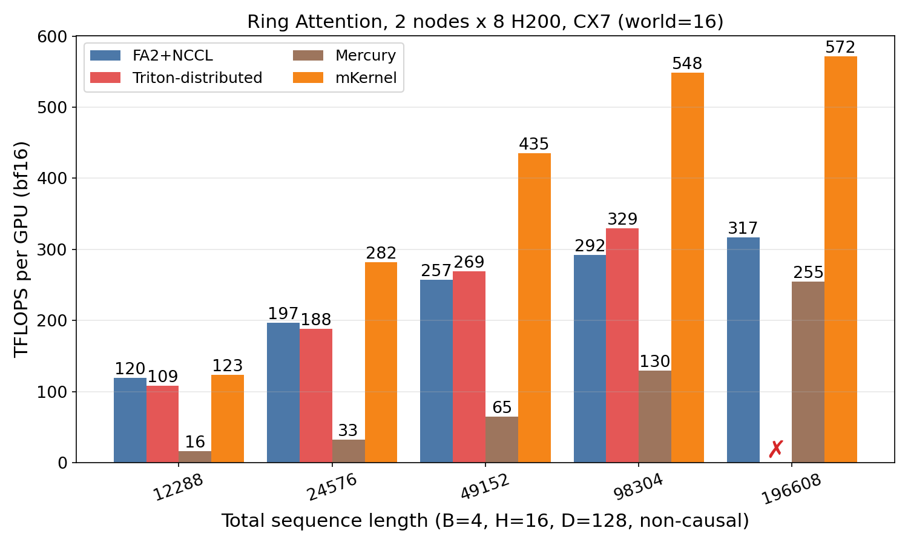
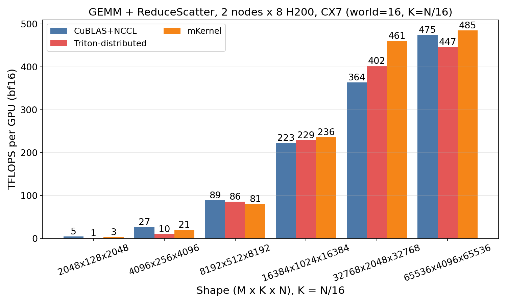

# mKernel

<div align="center" >
    <br/>
    <em>mKernel: multi-GPU, multi-node fused kernels</em><br/><br/>
</div>

## Highlights

- **Multi-GPU + multi-node, in one kernel.** Handling both intra-node and inter-node GPU-driven communication inside the same kernel.
- **Fine-grained intra-kernel overlapping.** Compute and communication overlap at tile/chunk granularity. 
- **Persistent kernel with SM specialization.** CTAs are assigned roles, such as compute / intra-comm / inter-send / inter-reduce. 
- **GPU-driven networking, built from scratch.** Directly implement communication over Libibverbs (without NCCL/NVSHMEM) for maximal performance.

_mKernel is under active development, including optimizing for larger scale, different GPUs, and network topologies. The goal is to have a library for commonly used multi-node/GPU distributed kernels._

## Roadmap
- ✅ Fused, GPU-driven multi-node kernels
- ✅ Add CX7 and EFA backend
- 🚧 Full support for heterogeneous accelerators and NICs
  - 🚧 Topology-aware accelerator and NIC discovery, placement, and routing
- 🚧 Internode megakernels
- 🚧 Support for Blackwell GPUs

## Kernels

| Kernel | What it fuses | Description |
|---|---|---|
| **AllGather + GEMM** | AllGather → GEMM | Each rank holds a shard of the activation `A`. While ranks gather peers' shards over NVLink/RDMA, the local GEMM consumes tiles as soon as they arrive — overlapping the gather with `(A_full @ B)` so the matmul starts before the collective finishes. |
| **GEMM + AllReduce** | GEMM → AllReduce | Computes `C = A @ B` and reduces partial outputs across all 16 ranks in one launch. Output tiles are pushed into the reduction tree the instant they're produced, hiding the AllReduce inside the GEMM tail. |
| **MoE Dispatch + GEMM** | All-to-All dispatch → grouped GEMM | Routes MoE tokens to their expert ranks (intra-node NVLink + inter-node all-to-all) and runs the per-expert grouped GEMM in the same kernel. Tokens are matmul'd as soon as they land, no staging buffer round-trip. |
| **Ring Attention** | Ring KV exchange → FlashAttention | Sequence-parallel attention across 16 ranks: each step rotates a KV chunk around the ring while the local FlashAttention consumes the previously-received chunk. Compute and the ring send/recv run concurrently inside a single persistent kernel. |
| **GEMM + ReduceScatter** | GEMM → ReduceScatter | Computes `C = A @ B` and reduce-scatters the output across ranks. Each output tile is reduced and forwarded to its owning rank as soon as it's produced, so the scatter overlaps the GEMM rather than following it. |

## Quick start

```sh
make BACKEND=cx7 all                  # build all 5 .so's against ConnectX-7 RC (libibverbs)
bash bench/run.sh all bench 2         # 2 nodes, all kernels, default shapes
make plots                            # regenerate the figures below
```

## Backends

| Backend | Macro | Transport | Where it runs |
|---|---|---|---|
| **CX7** | `-DINTERNODE_BACKEND_IBVERBS` | libibverbs RC | ConnectX-7 / InfiniBand / RoCE |
| **EFA** | `-DINTERNODE_BACKEND_EFA` | libibverbs + efadv (SRD) | AWS p5/p5e (H200, EFA) |

Both backends share the same host-side API and the same on-GPU kernel; only the proxy / session implementation differs (`include/comm/internode/session.h` for CX7, `session_efa.h` for EFA).


## Comparison results — AWS EFA

| Kernel | Plot |
|---|---|
| AllGather + GEMM |  |
| GEMM + AllReduce |  |
| MoE Dispatch + GEMM |  |
| Ring Attention |  |
| GEMM + ReduceScatter |  |

## Comparison results — ConnectX-7

| Kernel | Plot |
|---|---|
| AllGather + GEMM |  |
| GEMM + AllReduce |  |
| Ring Attention |  |
| GEMM + ReduceScatter |  |

## Acknowledgements

The MMA / compute code is adapted from [ThunderKittens](https://github.com/HazyResearch/ThunderKittens) (HazyResearch). Many thanks to the TK authors for the tile-level abstractions and warpgroup MMA primitives we build on top of.

## License

MIT — see [LICENSE](LICENSE).

